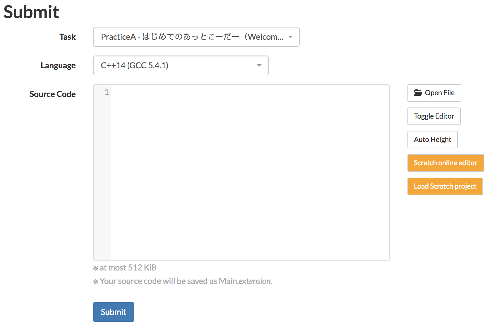

# Chrome extension "Scratcher's AtCoder"

## Installation

1. Clone or download this directory

2. Launch Google Chrome and go to Window -> Extensions

3. Turn on "Developper Mode"

4. "Load Unpacked Extension" -> select this directory ( `crx` ) 

After installation (and activation), go to AtCoder **beta** (https://beta.atcoder.jp/).
There will be orange buttons in submit pages and problem pages.

## Usage

1. Press orange `Scratch online editor` button to open the online editor, and create your solution.

2. If your solution is ready, download your Scratch project to a local file. (File -> Download to your computer)

3. Return to AtCoder and press orange `Load Scratch project` button. Then select your Scratch project file.

4. Your Scratch project file will be converted to C++ source, and displayed in the solution form.

5. Submit it! (Make sure that `C++14(GCC 5.4.1)` (or later) is selected as the language.)
