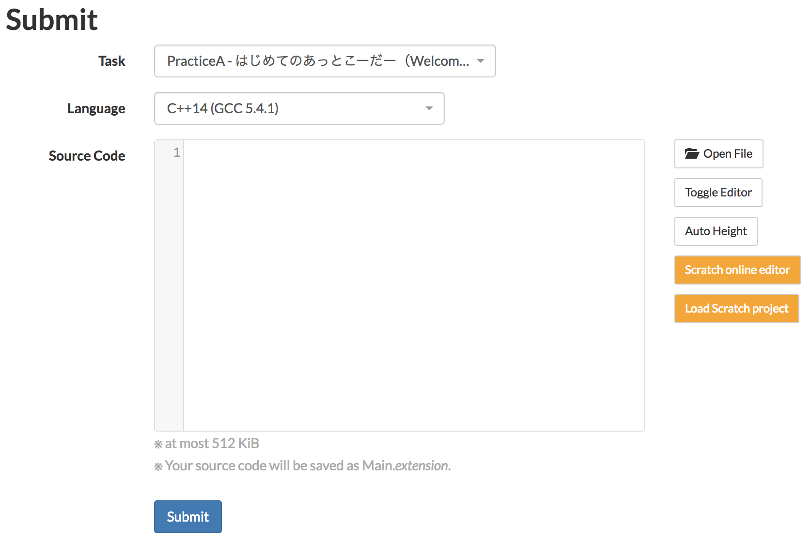

# Chrome extension "Scratcher's AtCoder"

## Installation

This Chrome extension is released at the [web store](https://chrome.google.com/webstore/detail/scratchers-atcoder/hackndbjgkehhjinjjoldifbhnfddklh). You can install it from there.

Alternatively, you can install it manually:

1. Clone or download this directory

2. Launch Google Chrome and go to Window -> Extensions

3. Turn on "Developper Mode"

4. "Load Unpacked Extension" -> select this directory ( `crx` )

After installation (and activation), go to AtCoder (https://atcoder.jp/).
There will be orange buttons in submit pages and problem pages.

## Usage

1. Go to a submission form of AtCoder, and click orange "Scratch 3.0 online editor" button to open the online editor.

2. Create your solution in Scratch online editor. If your solution is ready, download your Scratch project to a local file. ([File] -> [Save to your computer])

3. Return to AtCoder and click the orange "Load Scratch project" button. Then select your Scratch project file you downloaded in (2).

4. Your Scratch project file will be instantly converted to C++ source, and displayed in the solution form.

5. Submit it! (Make sure that "C++14(GCC 5.4.1)" (or newer) is selected as the language.)

## Blocks supported in scratch2cpp

See [here](../../blocks.md).
